<!-- ==================================================================== -->
<!-- ADAPTIVE BANNER SVG (DARK / LIGHT THEME PREFERENCE)                   -->
<!-- ==================================================================== -->
<picture>
  <source media="(prefers-color-scheme: dark)" srcset="assets/dark.svg">
  <source media="(prefers-color-scheme: light)" srcset="assets/light.svg">
  
</picture>

  

<!-- ==================================================================== -->
<!-- DYNAMIC TYPING BANNER                                                -->
<!-- ==================================================================== -->

 

<!-- ==================================================================== -->
<!-- METRICS & BADGES BAR                                                 -->
<!-- ==================================================================== -->

  
  
  

---

## ⚡ ABOUT ME

<table width="100%" border="0" cellspacing="0" cellpadding="0">
  <tr>
    <td width="65%" valign="top">
       
      <h3>👋 Hi there! I'm <b>Kanchan Bhatt</b></h3>
      

        I am a <b>Computer Science Student</b> with a relentless drive for engineering high-performance software, intuitive user interfaces, and scalable backend infrastructure. 
      

      

        My journey in technology spans <b>Full Stack Web Systems</b>, <b>Distributed Architectures</b>, <b>AI/ML Model Development</b>, and <b>Competitive Algorithm Design</b>. I believe software should be as visually breathtaking as it is technically sound.
      

      <ul>
        <li>🔭 <b>Currently Focused On:</b> Building scalable distributed microservices & AI applications</li>
        <li>🎓 <b>Academic Pursuit:</b> B.Tech in Computer Science & Engineering</li>
        <li>💻 <b>Core Philosophy:</b> Minimalist UI design combined with resilient system design</li>
        <li>🌱 <b>Learning & Exploring:</b> System Architecture, Go Microservices, PyTorch, & WebAssembly</li>
        <li>💬 <b>Ask Me About:</b> React, Next.js, Node.js, C++, Python, Data Structures & Algorithms</li>
      </ul>
       
    </td>
    <td width="35%" align="center" valign="middle">
      
    </td>
  </tr>
</table>

---

## 🚀 TECH STACK & SKILLS

<i>Languages, Frameworks, Libraries, Databases, and Tools I work with daily</i>

 

### 💻 Languages

  
  
  
  
  
  
  

### 🌐 Frontend & UI Engineering

  
  
  
  
  
  

### ⚙️ Backend, Databases & Infrastructure

  
  
  
  
  
  
  
  

### 🤖 AI & Data Science

  
  
  
  
  

---

## 🌟 FEATURED PROJECTS

<table width="100%" border="0" cellspacing="0" cellpadding="8">
  <tr>
    <td width="50%" valign="top">
      

        <h3>🛍️ The Silk Route</h3>
        
<b>Full-Stack E-Commerce & Global Trade Platform</b>

        
A flagship modern web platform built for seamless digital commerce. Features dynamic cart orchestration, secure payment gateways, order management, and glassmorphic micro-interactions.

        

          
          
          
          
        

        

          <a href="https://github.com/kanchn-https/The-Silk-Route"><b>📂 View Repository</b></a>
        

      

    </td>
    <td width="50%" valign="top">
      

        <h3>🏡 Staayzy</h3>
        
<b>Smart Accommodation & Rental Platform</b>

        
A high-performance property booking and management web application. Includes interactive search filters, user authentication, map integrations, and real-time reservation tracking.

        

          
          
          
          
        

        

          <a href="https://github.com/kanchn-https/Staayzy"><b>📂 View Repository</b></a>
        

      

    </td>
  </tr>
  <tr>
    <td width="50%" valign="top">
      

        <h3>🔗 Distributed URL Shortener</h3>
        
<b>Scalable High-Throughput Backend Service</b>

        
Engineered a distributed URL reduction microservice capable of processing thousands of requests per second. Features Base62 encoding, Redis caching, rate limiting, and analytics tracking.

        

          
          
          
          
        

        

          <a href="https://github.com/kanchn-https/Distributed-URL-Shortener"><b>📂 View Repository</b></a>
        

      

    </td>
    <td width="50%" valign="top">
      

        <h3>💻 C-Edit IDE</h3>
        
<b>Lightweight Code Editor & Execution Environment</b>

        
A fast, browser and desktop code editor supporting syntax highlighting, custom file system operations, inline execution, and AST parsing for C/C++ and JavaScript code bases.

        

          
          
          
          
        

        

          <a href="https://github.com/kanchn-https/C-Edit-IDE"><b>📂 View Repository</b></a>
        

      

    </td>
  </tr>
  <tr>
    <td width="100%" colspan="2" valign="top">
      

        <h3>📈 Stock Price Prediction</h3>
        
<b>AI/ML Financial Forecasting & Analytics System</b>

        
Machine learning application leveraging Recurrent Neural Networks (RNN) and Long Short-Term Memory (LSTM) models to analyze historical financial data and forecast future market trend trajectories with high precision.

        

          
          
          
          
        

        

          <a href="https://github.com/kanchn-https/Stock-Price-Prediction"><b>📂 View Repository</b></a>
        

      

    </td>
  </tr>
</table>

---

## 📊 GITHUB METRICS & ANALYTICS

  
  

  

  

---

## 🐍 CONTRIBUTION SNAKE

<picture>
  <source media="(prefers-color-scheme: dark)" srcset="assets/github-contribution-grid-snake.svg">
  <source media="(prefers-color-scheme: light)" srcset="assets/github-contribution-grid-snake.svg">
  
</picture>

---

## 🤝 CONNECT & COLLABORATE

<i>Let's build something extraordinary together! Feel free to reach out.</i>

  
  
  
  
  
  

 

<!-- ==================================================================== -->
<!-- INSPIRATIONAL QUOTE                                                  -->
<!-- ==================================================================== -->
<blockquote>
  

    <i>"Simplicity is prerequisite for reliability. Software engineering is the art of building systems that last."</i>
  

</blockquote>

 

<!-- ==================================================================== -->
<!-- PINK CAPSULE RENDER FOOTER                                           -->
<!-- ==================================================================== -->

